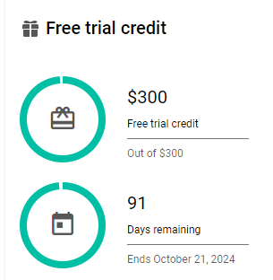
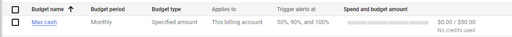
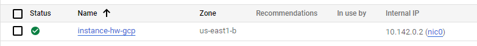

1. Зарегистрироваться на облачном провайдере Google Cloud Platform (GCP)
- В качестве локации указать Грузию.
- Привязать банковскую карту РБ/РФ.
- Получить кредиты от GCP (300$) путем верификации карты.

    
2. Настроить предупреждения для бюджета (например, 50$ на месяц).

    
3. Создать свою первую VM в облаке, зайти на неё по SSH и установить Nginx/Apache.

    

    ```console
    root@instance-hw-gcp:/home/sergeinowik# hostnamectl 
    Static hostname: instance-hw-gcp
        Icon name: computer-vm
            Chassis: vm 🖴
        Machine ID: 6db0933a3635429d8a9689483aa23b60
            Boot ID: 4f2dc47c0c5d4d1f9bd70e73afb7d773
    Virtualization: google
    Operating System: Debian GNU/Linux 12 (bookworm)  
            Kernel: Linux 6.1.0-22-cloud-amd64
        Architecture: x86-64
    Hardware Vendor: Google
    Hardware Model: Google Compute Engine
    Firmware Version: Google
    root@instance-hw-gcp:/home/sergeinowik# systemctl status nginx
    ● nginx.service - A high performance web server and a reverse proxy server
        Loaded: loaded (/lib/systemd/system/nginx.service; enabled; preset: enabled)
        Active: active (running) since Mon 2024-07-22 14:57:09 UTC; 3min 34s ago
        Docs: man:nginx(8)
        Process: 1041 ExecStartPre=/usr/sbin/nginx -t -q -g daemon on; master_process on; (code=exited, status=0>
        Process: 1042 ExecStart=/usr/sbin/nginx -g daemon on; master_process on; (code=exited, status=0/SUCCESS)
    Main PID: 1067 (nginx)
        Tasks: 3 (limit: 2344)
        Memory: 2.2M
            CPU: 29ms
        CGroup: /system.slice/nginx.service
                ├─1067 "nginx: master process /usr/sbin/nginx -g daemon on; master_process on;"
                ├─1069 "nginx: worker process"
                └─1070 "nginx: worker process"
    ```
4. Создать Firewall правило для подключения к этой VM со своей локальной машины по порту 80. Проверить, что доступ работает.

    